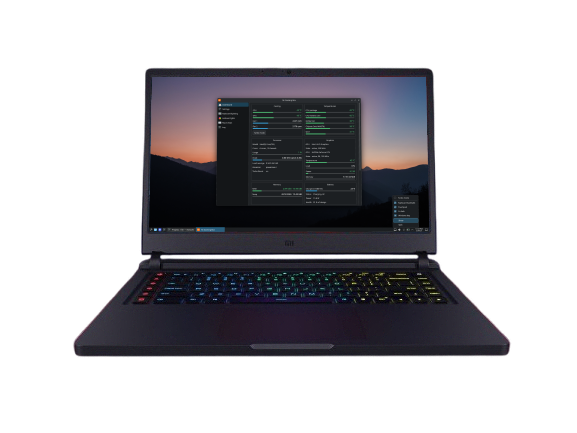
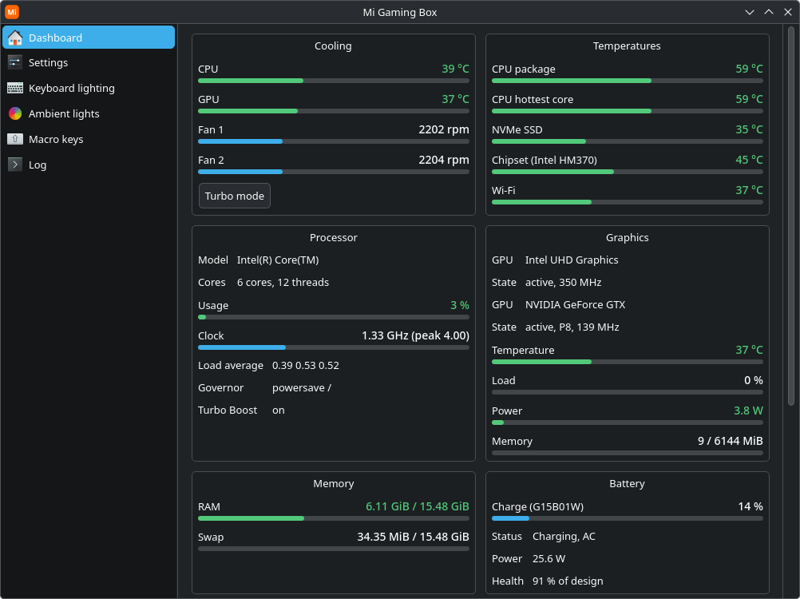
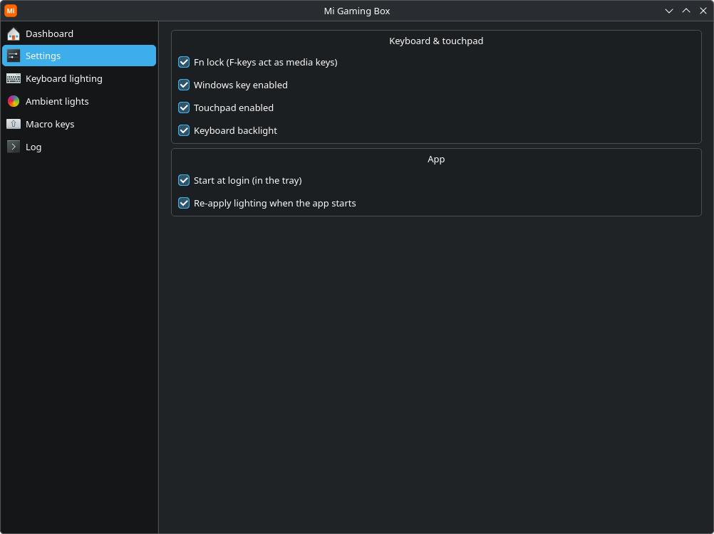
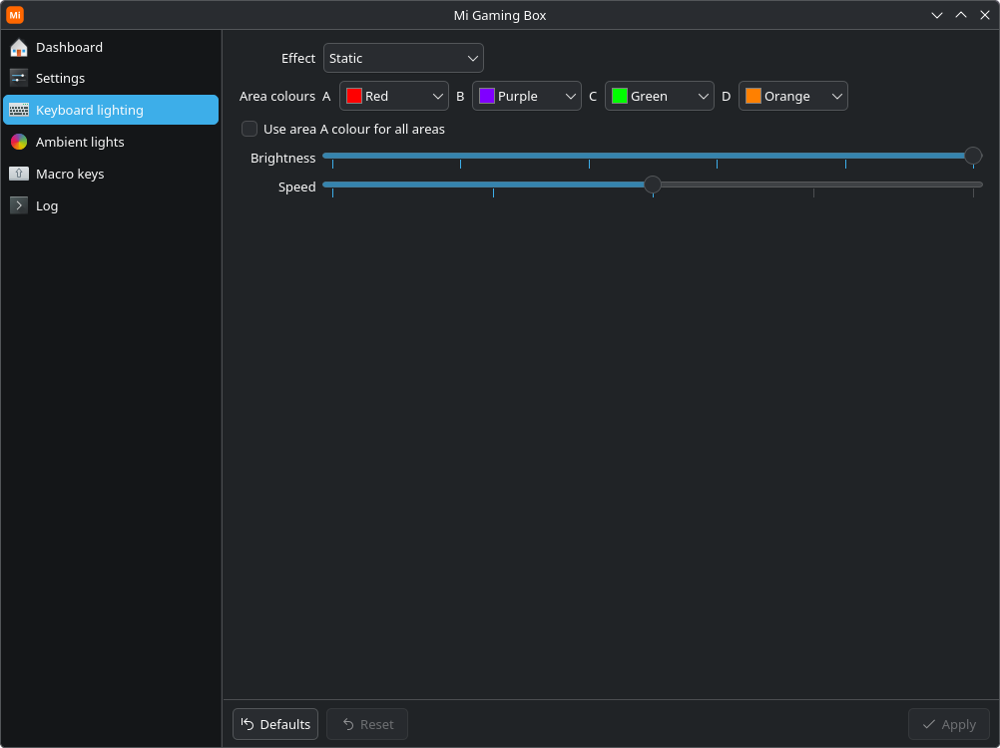
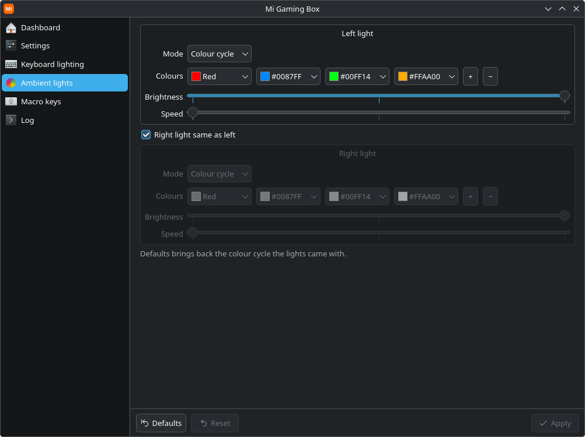
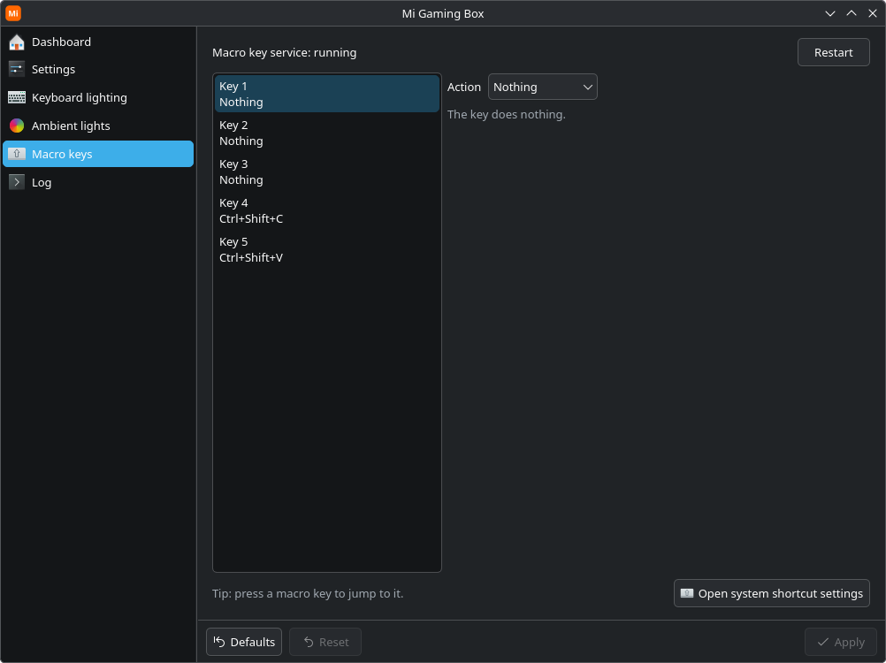

<p align="center"></p>

# Mi Gaming Box for Linux

An open-source Linux replacement for Xiaomi's Windows **GamingBox** utility on the
**Xiaomi Mi Gaming Laptop (2018, model TM1801)**. Turbo fans, RGB lighting,
keyboard switches and the five macro keys, which Linux otherwise ignores.



It talks to the same firmware interface the Windows app uses: a WMI data block on
ACPI device `\_SB.MIAP`, reached through the `acpi_call` kernel module. How that
interface was worked out is documented in [FINDINGS.md](FINDINGS.md).

> Not affiliated with Xiaomi. It writes to your laptop's embedded controller, so
> use it at your own risk. See [NOTICE](NOTICE).

## Features

| Feature | Status |
|---|---|
| Turbo fan mode | ✅ tested |
| CPU / GPU temperature, both fan speeds | ✅ tested |
| 5 macro keys: shortcuts, typed text, commands, multi-step macros | ✅ keys tested, editor new |
| Fn lock, Windows key, touchpad | ✅ reading tested, switching expected to work |
| Keyboard backlight on/off | ✅ tested |
| NVIDIA GPU off / on (integrated or hybrid at startup, turn on live) | 🧪 new |
| Battery saver (powertop-style idle power settings, reversible) | 🧪 new |
| Keyboard RGB (4 areas, brightness 0–5, speed, Static / Breath effects) | ✅ tested (`tools/kbdtest`) |
| Ambient light bars (left / right: off, steady, breathing, colour cycle) | ✅ works (TM1801) |

Only tested on **TM1801** (`cat /sys/class/dmi/id/product_name`). On any other
machine the tools refuse to touch the firmware. If you have a related Xiaomi model
and want to experiment, see [Other models](#other-models).

## The app

It's laid out like KDE's System Settings, with a page for each part of the laptop.
The lighting and macro pages have **Defaults / Reset / Apply** along the bottom, so
nothing changes until you apply it.

### Dashboard

Everything at a glance, shown at the top of this page. **Turbo mode** sits with the fan
speeds and the embedded controller's CPU/GPU temperatures. Below that are the other
temperature sensors, CPU load and clock, both GPUs (the NVIDIA card is only read while
it's already awake, so the page never wakes it and drains your battery), memory,
battery (time left, health), storage and system info.

**Battery saver** (in the Battery box and the tray menu) makes the same idle power
settings as `powertop --auto-tune`: idle PCI and USB devices sleep, the SATA link and the
audio codec power down, and the disk is flushed less often. With the NVIDIA GPU off it took
the laptop from about 13 W to about 10 W at idle. It also moves Plasma's Power Profile to
Power saver (the CPU clocks up less eagerly) and back to Balanced when you turn it off. USB input
devices are left alone (autosuspend can delay the first keypress or mouse move). Turning it
off puts every setting back as it was; a restart turns it off too.

### Settings



The laptop's own switches: **Fn lock**, the **Windows key**, the **touchpad** and the
**keyboard backlight**. They also sit in the tray menu. **Start at login** puts the app
in the tray when you log in, and **Re-apply lighting** restores your colours after a
reboot. The keyboard's lighting chip forgets them at shutdown, and GamingBox on Windows
fixes this the same way.

**Graphics** can switch the NVIDIA GPU off for much better battery life. This GTX 1060
is too old to power itself down, so it otherwise idles at around 5 W. Choose whether the
laptop **starts with the GPU off** (integrated graphics) or on (hybrid), and **turn it on**
whenever you need it for a game, with no restart. It's also in the tray menu. Turning it
off happens straight away if nothing is using it, otherwise at the next restart. The
HDMI port is wired to the NVIDIA GPU, so it only works while the GPU is on. If a boot
ever goes wrong, add `mi_gaming_box.gpu=hybrid` to the kernel command line in your boot
menu to start with the GPU on.

### Keyboard lighting



The keyboard has four colour areas, left to right. Pick a named colour or any custom
colour for each, or one colour for all of them. Choose an effect (static or breathing),
brightness and speed.

### Ambient lights



The two light bars. Each can be **Off**, **Steady**, **Breathing** or a **Colour cycle**
through up to 8 colours, with its own brightness and speed. Set them together or
separately. **Defaults** brings back the colour cycle they shipped with.

### Macro keys



The five extra macro keys, which do nothing on Linux out of the box. Give each one:

- a **shortcut**, recorded like in KDE's shortcut settings. It's held while you hold the
  key, so push-to-talk works.
- some **text** to type
- a **command or script** to run. It runs as you, never as root.
- a **macro**: a list of shortcuts, text and pauses

Press a macro key and the page jumps to it. There's also a **Log** page listing what
the app did, which helps when something doesn't work.

## Install

You need Python 3, PySide6, python-evdev, polkit, systemd, and the **acpi_call**
kernel module (plus your kernel's headers if acpi_call is built with DKMS).

### Arch / CachyOS / Manjaro

```
sudo pacman -S --needed git base-devel linux-headers    # or linux-cachyos-headers etc.
git clone https://github.com/missingfoot/mi-gaming-box.git
cd mi-gaming-box
makepkg -si
sudo systemctl enable --now mikeysd
```

### Debian / Ubuntu

```
sudo apt install git make python3-pyside6.qtwidgets python3-evdev acpi-call-dkms policykit-1
git clone https://github.com/missingfoot/mi-gaming-box.git
cd mi-gaming-box
sudo make install
sudo systemctl daemon-reload && sudo systemctl enable --now mikeysd
```

### Fedora

```
sudo dnf install git make python3-pyside6 python3-evdev polkit
# acpi_call is not packaged: build it from https://github.com/nix-community/acpi_call
git clone https://github.com/missingfoot/mi-gaming-box.git
cd mi-gaming-box
sudo make install
sudo systemctl daemon-reload && sudo systemctl enable --now mikeysd
```

The Debian/Ubuntu and Fedora package names are best-effort and untested. Corrections are welcome.
`sudo make uninstall` removes a `make install`.

## Usage

- **Mi Gaming Box** (in your app menu, or `migamingbox`) is the control panel, shown
  [above](#the-app), with a tray icon for Turbo mode and the switches. No password is
  needed in your normal desktop session: polkit authorises its small root helper.
  Options: `--tray` starts it hidden, `--demo` runs it without hardware. Tick
  **Start at login** and **Re-apply lighting** on the Settings page to keep your
  lighting across reboots.
- **Macro keys**: set each of the five keys (top to bottom) on the app's Macro keys
  page: a **shortcut** (recorded like in KDE's shortcut settings, held while you hold
  the key, so push-to-talk works), **typed text**, a **command or script**, or a
  **macro** (a list of shortcuts, text and pauses). `mikeysd.service` does the key
  presses; commands run as you through the app, so keep it running (Settings →
  Start at login). The settings live in `/etc/mi-gaming-box/macros.json`; without it
  the old `keys.conf` (F13–F17 by default) still works. `sudo mikeysd --probe` shows
  raw key events.
- **CLI**: `sudo miwmi status`, `sudo miwmi turbo on|off`,
  `sudo miwmi fnlock|winlock|touchpad|powerled|kbdlight on|off`, and
  `sudo miwmi light` to read the ambient lights' settings, `sudo miwmi gpu status|on|off`,
  `sudo miwmi powersave status|on|off`, and
  `sudo miwmi raw FA00 0102` for any raw command.

## Other models

The firmware interface looks like a Quanta design and may exist on other Xiaomi
gaming laptops. Before trying, check that your DSDT has `Device (MIAP)` with a
`WSAA` method (`sudo acpidump -b && iasl -d dsdt.dat`). Then create
`/etc/mi-gaming-box/force` to override the model check, and for the key daemon add
a systemd drop-in that clears `ConditionFirmware=`. Please report what works.

## Development

Everything runs straight from a checkout (`./migamingbox --demo`,
`sudo ./miwmi status`, `sudo ./mikeysd --probe`). The code lives in
`migamingboxlib/`. The launchers at the repo root find it there, or in
`/usr/lib/mi-gaming-box/` when installed.

## License

GPL-2.0-or-later. See [LICENSE](LICENSE) and [NOTICE](NOTICE).
